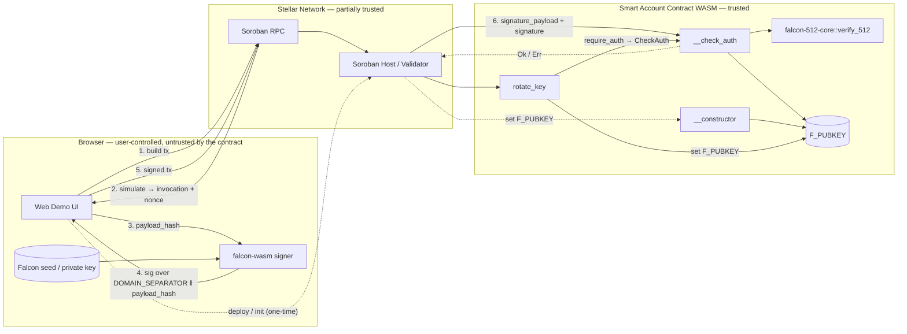

# STRIDE Threat Model — Soroban Falcon Smart Account

| | |
| --- | --- |
| Project | `stellar-pq` — post-quantum smart account on Stellar Soroban |
| Version | First model; covers commits up to `f37ac25` (2026-05-05) |
| Scope | `contracts/falcon-512-core` (Falcon-512 verifier primitive) and `contracts/soroban-falcon-smart-account` (`CustomAccountInterface` impl: storage, domain separation, key rotation, `__check_auth`) |
| Out of scope | Soroban host (`soroban-env-host`), validator consensus, the standalone `soroban-falcon-verifier` contract (no auth surface), and **any off-chain signer or frontend** (including the reference `web-demo/` and the vendored `falcon-wasm` signer). Frontends are user-replaceable; the contract MUST remain secure under any conforming — including malicious — signer. |
| Owner | Soundness Labs |
| Methodology | Stellar SCF Audit Bank STRIDE template ([reference](https://developers.stellar.org/docs/build/security-docs/threat-modeling/STRIDE-template)) |

---

## 1. What are we working on?

### System overview

The smart account replaces the default Ed25519-based Stellar account with a
Falcon-512 (post-quantum) signing scheme. A user holds a Falcon-512 seed
off-chain. At account creation, the public key is written to instance
storage of a Soroban contract that implements `CustomAccountInterface`. From
that point on, every transaction the account authorizes is gated by
`__check_auth`, which Falcon-verifies the off-chain signature against the
host-provided `signature_payload`.

Three crates back this:

- **`falcon-512-core`** — `no_std`, soroban-sdk-free Falcon-512 verifier.
  Defines `verify_512(pk, msg, sig)`. Shared by both Soroban contracts so
  crypto fixes land in one place.
- **`soroban-falcon-smart-account`** — `CustomAccountInterface`
  implementation. Owns `F_PUBKEY` storage, `rotate_key`, and the
  domain-separated `__check_auth`.
- **`soroban-falcon-verifier`** — standalone "verify these bytes for me"
  contract. **Out of scope** for this model: it has no auth surface; it
  just exposes Falcon verification as a public utility.

A reference off-chain signer is provided under `web-demo/` for testing
and demonstration; it builds the authorization preimage, prepends
`DOMAIN_SEPARATOR`, and signs with the vendored `falcon-wasm`. **The web
demo is out of scope.** Any conforming frontend can drive the contract;
the security argument below holds against an arbitrary (including
malicious) frontend.

### Data flow diagram

**Trust boundaries.**

- **B1 — Browser ↔ Network.** Out of audit scope. The contract treats
  everything reaching it across B1+B2 as adversarial. The security
  argument relies only on `__check_auth` rejecting any payload it cannot
  Falcon-verify under the stored pubkey.
- **B2 — Network ↔ Contract.** The Soroban host hands `__check_auth` the
  canonical `signature_payload` (SHA-256 of the XDR
  `HashIdPreimageSorobanAuthorization`). The contract trusts only this
  host-built value — not anything the browser or RPC asserts.

### Asset inventory

| Asset | Location | Sensitivity |
| --- | --- | --- |
| Falcon-512 private key (seed) | Browser memory / user-managed storage | **Critical** — controls the account |
| Falcon-512 public key | `F_PUBKEY` (instance storage) | Public-by-design |
| Authorization preimage / `signature_payload` | Transient, host-built | Public-by-design |
| Account funds, sub-balances, sub-state | Soroban ledger | Critical |
| `DOMAIN_SEPARATOR` constant | Source code (`b"soroban-falcon-smart-account-v1"`) | Public-by-design — load-bearing for cross-context replay protection |

### What `signature_payload` actually binds

This matters for almost every threat below. The host hands `__check_auth`
a 32-byte `signature_payload` that is `SHA-256` over the XDR-encoded
`HashIdPreimageSorobanAuthorization` struct, which contains:

| Field | Purpose |
| --- | --- |
| `networkId` | Pins the signature to a specific Stellar network (testnet, mainnet, futurenet). |
| `nonce` | Per-call unique value; the host refuses replay of consumed nonces. |
| `signatureExpirationLedger` | Maximum ledger at which the signature is valid. |
| `invocation` | The full `rootInvocation` — contract address, function, args, sub-invocations. |

The off-chain signer must reconstruct the same XDR preimage and hash it.
The reference `web-demo` signer demonstrates this at
`web-demo/src/lib/stellar/smart-account.ts:701` for completeness, but the
reference is illustrative only — out of scope for this model.

---

## 2. What can go wrong?

### STRIDE reminders

| Mnemonic | Definition | Question we must answer |
| --- | --- | --- |
| **S**poofing | Pretending to be someone else | Can an attacker authorize as the account holder? |
| **T**ampering | Changing data or code | Can an attacker modify the payload, sig, pubkey, or contract state? |
| **R**epudiation | Denying an action took place | Can the holder credibly deny signing a tx? |
| **I**nformation Disclosure | Leaking data | Does the contract leak anything beyond what's already public on-chain? |
| **D**enial of Service | Making the account unusable | Can an attacker brick or grief the account? |
| **E**levation of Privilege | Gaining unintended capability | Can a caller invoke privileged paths without the right key? |

### Threats

| Category | Issues |
| --- | --- |
| **Spoofing** | **Spoof.1** — An attacker forges a Falcon signature for an arbitrary `signature_payload` and submits a tx as the account.   **Spoof.2** — An attacker captures a Falcon signature produced for the standalone `soroban-falcon-verifier` contract and replays it against `__check_auth` (or vice versa).   **Spoof.3** — An attacker captures a valid testnet signature and replays it on mainnet (or the inverse).   **Spoof.4** — An attacker captures a previously-submitted signature and re-broadcasts it to repeat the authorization.   **Spoof.5** — An attacker submits a tx whose `_auth_contexts` differ from what the user intended to sign (e.g. user signed "transfer 1 XLM", attacker submits "transfer 1000 XLM"). |
| **Tampering** | **Tamper.1** — A network operator (or RPC) modifies bytes of the signed transaction in flight.   **Tamper.2** — An attacker writes directly to `F_PUBKEY` to substitute their own key.   **Tamper.3** — An attacker submits a non-canonical Falcon signature: a compressed encoding followed by garbage trailing bytes that the decoder ignores. |
| **Repudiation** | **Repudiate.1** — The account holder later claims they did not authorize a transaction that succeeded.   **Repudiate.2** — A failed `__check_auth` leaves no on-chain trace, complicating after-the-fact incident review. |
| **Information Disclosure** | **Info.1** — `__check_auth` execution time leaks information about the signature contents (e.g. nonce bits, position of rejected polynomial coefficients).   **Info.2** — The off-chain Falcon seed leaks (browser malware, malicious extension, hostile RPC operator script-injecting the demo page).   **Info.3** — Reuse of the same Falcon public key across multiple accounts allows third parties to link those accounts. |
| **Denial of Service** | **DoS.1** — An attacker submits a transaction whose `signature_payload`-input message exceeds `FALCON_MAX_MESSAGE_SIZE`, forcing the verifier to allocate a buffer it can't service.   **DoS.2** — An attacker submits an oversized signature (`> FALCON_SIG_MAX_SIZE`) to exhaust the per-byte copy loop.   **DoS.3** — An attacker submits a Falcon CT-format (809-byte) signature, hoping the dispatcher pulls in a CT decoder path that has not been audited.   **DoS.4** — An unexpected condition inside `__check_auth` (missing pubkey, malformed stored bytes) triggers a `panic!`, propagating as a host trap and making the account unusable for the entire ledger.   **DoS.5** — An attacker spams `rotate_key` calls to burn the account's stored fees.   **DoS.6** — Operator deploys the contract with a malformed public key, bricking the account from minute zero.   **DoS.7** — An attacker submits an `__check_auth` whose Falcon polynomial work consumes more gas than the account holder budgeted. |
| **Elevation of Privilege** | **Elevation.1** — A caller invokes `rotate_key(new_pk)` without proving control of the current key.   **Elevation.2** — An attacker constructs a payload that bypasses the domain-separation tag prepending, then re-uses a signature from a non-smart-account context.   **Elevation.3** — Key rotation race: an attacker who has stolen the current key submits a malicious tx in the same ledger as the user's `rotate_key`; if the malicious tx is sequenced first, it lands.   **Elevation.4** — A malformed canonicity check lets the attacker forge a signature whose decoded polynomial differs from what the verifier later operates on. |

---

## 3. What are we going to do about it?

Each mitigation is keyed to its threat using `[ThreatID].R.[N]`. Code
citations are `file:line` against the commits in this repo.

### Spoofing

| ID | Mitigation |
| --- | --- |
| **Spoof.1.R.1** | Falcon-512 is EUF-CMA secure under the lattice assumptions reviewed by NIST. Forging a signature without the seed is computationally infeasible. The verifier path is `__check_auth` → `FalconVerifier::verify_512` (`contracts/falcon-512-core/src/verify.rs:58`), which uses the upstream-vetted hash-to-point + NTT-based verification. The implementation is regression-tested against **all 100 official NIST Falcon-512 KAT vectors** (`contracts/soroban-falcon-{verifier,smart-account}/tests/kat.rs` + `falcon512-KAT.rsp`), with negative tests `test_kat_wrong_message` and `test_kat_wrong_public_key` confirming the verifier rejects mutated inputs. |
| **Spoof.2.R.1** | `__check_auth` Falcon-verifies `DOMAIN_SEPARATOR ‖ signature_payload` rather than `signature_payload` alone (`contracts/soroban-falcon-smart-account/src/lib.rs:44`, assembled at `lib.rs:152-165`). The standalone verifier contract intentionally does not prepend a tag, so a signature valid for one is computationally invalid for the other. |
| **Spoof.2.R.2** | A unit test (`test_domain_separator_is_fixed`, `lib.rs:253-258`) asserts the tag's exact bytes, so an accidental rename fails CI rather than silently breaking deployments. |
| **Spoof.3.R.1** | The `signature_payload` includes `networkId` (SHA-256 of the network passphrase). A testnet signature embeds testnet's hash; mainnet's host computes a different `signature_payload` and Falcon verification fails. |
| **Spoof.4.R.1** | The `signature_payload` includes `nonce`. The Soroban host tracks consumed nonces in account storage and refuses any auth entry whose nonce has already landed, regardless of signature validity. |
| **Spoof.4.R.2** | The `signature_payload` includes `signatureExpirationLedger`. After that ledger, the host refuses the auth entry even if the nonce is fresh. |
| **Spoof.5.R.1** | The `signature_payload` includes the full `rootInvocation` (target contract, function name, args, and sub-invocations). Any change to those bytes changes the SHA-256 input and the signature no longer verifies. The contract intentionally ignores `_auth_contexts` (`__check_auth` arg, `lib.rs:120`, with rationale at `lib.rs:108-114`) because the host has already established that the requested contexts are covered by the signed `rootInvocation`. |

### Tampering

| ID | Mitigation |
| --- | --- |
| **Tamper.1.R.1** | The `signature_payload` is the host-side SHA-256 of the XDR preimage. Any in-flight modification by an RPC or network operator changes the bytes the host hashes; the recomputed payload no longer matches what the user signed and `__check_auth` rejects. |
| **Tamper.2.R.1** | Soroban's host enforces that contract instance storage is writable only by the contract itself. The smart-account writes `F_PUBKEY` only inside `__constructor` (`lib.rs:64-73`) and `rotate_key` (`lib.rs:90-99`). External writes are not possible through the host API. |
| **Tamper.3.R.1** | `verify.rs:120-124` rejects any non-zero trailing byte after the compressed encoding ends. Padded-format signatures pass because their tail is exactly zeroes; malformed sigs with garbage tails are rejected with `false`. |

### Repudiation

| ID | Mitigation |
| --- | --- |
| **Repudiate.1.R.1** | Falcon-512 is non-repudiable under the same EUF-CMA argument as Spoof.1.R.1. A signature that verifies under `F_PUBKEY` over a specific `signature_payload` (which itself binds tx contents) constitutes proof. |
| **Repudiate.2.R.1** | The Stellar ledger records every `invokeHostFunction` operation, including failed ones. `__check_auth` returning an error variant produces a host failure that is captured in the transaction result; auditors can replay the ledger to inspect failed attempts. |

### Information Disclosure

| ID | Mitigation |
| --- | --- |
| **Info.1.R.1** | A constant-time analysis (Trail of Bits `constant-time-analysis` plugin) was run against `falcon-512-core` and the only identified issue (F-001, UDIV in `hash_to_point`'s rejection-sampling reduction) was remediated by replacing the `while v >= Q { v -= Q; }` loop with four constant-time `field_sub` calls (`verify.rs:333-336`, commit `06318c1`). See `docs/audit/constant-time-analysis.md` for full report. |
| **Info.1.R.2** | Even prior to the fix, the inputs flagged were derived from public data (SHAKE256 over public nonce + message), and Soroban's deterministic gas metering does not surface microarchitectural timing at the network layer. |
| **Info.2.R.1** | Out of scope for the contract layer — key custody is the frontend's responsibility. From the contract's point of view a leaked seed is indistinguishable from a legitimate user; damage is bounded by what each `signature_payload` authorizes (invocation + network + nonce + expiration are all bound; replay outside that scope is rejected per Spoof.3/4/5). Users needing stronger custody should drive the contract with a frontend that backs the seed with a hardware credential store (passkey / secure enclave). |
| **Info.3.R.1** | Accepted: this is the same property as any single-key account scheme. Holders who want unlinkability should deploy separate accounts with separate seeds. |

### Denial of Service

| ID | Mitigation |
| --- | --- |
| **DoS.1.R.1** | `verify.rs:71-73` rejects any `message.len() > FALCON_MAX_MESSAGE_SIZE` (16 384 bytes) before any allocation. The smart account further validates message length implicitly because `signature_payload` is always 32 bytes (a SHA-256 output) — the 16 KiB cap is for code-reuse safety. |
| **DoS.2.R.1** | `lib.rs:132-135` rejects any signature with `len < FALCON_SIG_MIN_SIZE (42)` or `len > FALCON_SIG_MAX_SIZE (666)` before per-byte copy. |
| **DoS.3.R.1** | A Falcon-512 CT-format signature is 809 bytes — already above `FALCON_SIG_MAX_SIZE`, so the size gate at `lib.rs:132-135` rejects it before any header inspection. The header byte's CT-nibble (`0x50 \| logn`) decode path was deleted from `verify.rs` so there is no reachable CT decoder; the test `test_ct_format_rejected_by_size_gate` (`verify.rs:403-409`) asserts this is the rejection path. |
| **DoS.4.R.1** | `__check_auth` does not call `unwrap()` or `expect()`. Missing `F_PUBKEY` returns `Error::PublicKeyMissing` and malformed bytes return `Error::InvalidPublicKeySize` (`lib.rs:122-130`); per-byte copies use `?` rather than `unwrap` (`lib.rs:137-150`). `get_pubkey` (`lib.rs:80`) still uses `expect` but is a read-only view function, not on the auth path. The only remaining `panic!` on a write path is in `__constructor` (`lib.rs:68`), which runs once at deploy time and is intentional (see DoS.6). |
| **DoS.5.R.1** | Each `rotate_key` call is itself an authorized invocation that costs gas to submit and consumes a nonce. Spamming requires the attacker to either pay all the fees themselves or hold the current Falcon key — and if they hold the key, draining funds is more attractive than griefing. |
| **DoS.6.R.1** | Accepted: a malformed pubkey at deploy time bricks the account, but this is a feature — it surfaces a deployment bug at construction time rather than at first transaction. The constructor explicitly validates `pubkey.len() == 897` (`lib.rs:67-69`). The web demo enforces the size client-side before submitting the deploy. |
| **DoS.7.R.1** | Soroban metering bounds total instructions per transaction. The verifier work for Falcon-512 is fixed (NTT over 512 coefficients, one SHAKE256 over 32 + 31 = 63 bytes, one fixed-size norm check). An attacker cannot inflate this by submitting a different signature; the rejection-sampling loop is also bounded because the SHAKE output is finite per call. The per-byte copy loops that Scout flags as `dos_unbounded_operation` are bounded by upstream `FALCON_SIG_MAX_SIZE`/`FALCON_MAX_MESSAGE_SIZE`/`FALCON_512_PUBKEY_SIZE` size gates that the static analyzer cannot trace; documented as F-FP-1 in [`scout-scan.md`](scout-scan.md) and [`remediation-log.md`](remediation-log.md). |

### Elevation of Privilege

| ID | Mitigation |
| --- | --- |
| **Elevation.1.R.1** | `rotate_key` calls `env.current_contract_address().require_auth()` (`lib.rs:94`), which causes Soroban to route the auth check back through this contract's `__check_auth` — i.e. rotation requires a Falcon signature from the **current** key. Standard key-rotation semantics. The size pre-check at `lib.rs:91-93` rejects bad new keys early before `require_auth` runs. |
| **Elevation.2.R.1** | The domain-separator prepending happens **inside** `__check_auth` (`lib.rs:152-165`) before `verify_512` is called. There is no caller-controlled path that skips it. The `payload_array` and `domain` are concatenated into a stack buffer whose length (`SIGNED_MESSAGE_MAX = 128`, declared at `lib.rs:48`) is asserted not to be exceeded; an over-length check (`lib.rs:160-162`) returns `Error::VerificationFailed` rather than truncating. |
| **Elevation.3.R.1** | Partially mitigated, partially operational. The contract correctly rejects post-rotation signatures from the old key (because `F_PUBKEY` has already changed). What it cannot prevent is a malicious tx racing the rotation in the same ledger. **Operational mitigation:** users should pause activity on the account before rotating (no in-flight signed payloads with the old key). **Possible code-level mitigation:** a future `pause()` / `unpause()` admin pair, or a "rotate with monotonic version counter" pattern. **Open item — see §3 follow-ups.** |
| **Elevation.4.R.1** | The decoder loop in `decode_sig_compressed` rejects `m == 0 && sign != 0` (negative zero) and `m > 2047` (overflow), and the canonicity check (Tamper.3.R.1) rejects trailing garbage. The decoded polynomial is what `verify_raw_512` operates on; the decoder cannot produce a polynomial that the verifier would treat differently than its bytes suggest. |

### Open follow-up items

These are not gaps in the current threat model so much as future work that
the model has surfaced:

1. **Elevation.3 — rotate-key race.** Decide whether to add a `pause()`
   admin pair. Not blocking for the audit, but worth scoping with the
   reviewer — some firms will recommend it as standard for any
   account-abstraction contract that supports key rotation.
2. **DoS.5 hardening.** Track gas spent per-account on failed
   `rotate_key` calls and rate-limit at a high water mark, if the audit
   firm flags spam as a real concern. Currently relies on economics.
3. **CI integration.** Wire `cargo audit`, `cargo clippy`, and the
   constant-time scan into a CI workflow so future commits cannot
   regress on these guarantees silently.

---

## 4. Did we do a good job?

### Reflection

- **Did the model surface anything not already in code?** Yes — the
  rotate-key race (Elevation.3) was identified by walking the data flow
  rather than by review of the diff. It is now an acknowledged
  operational concern with an open code-level follow-up.
- **Are mitigations real or aspirational?** Every mitigation in §3 is
  either in committed code (with `file:line`) or explicitly labeled
  "Operational" / "Out of scope" / "Open item". No hand-waving.
- **Did the model cite or test the load-bearing constants?** Yes —
  `DOMAIN_SEPARATOR` has a regression test (`test_domain_separator_is_fixed`),
  the size limits have rejection tests
  (`test_ct_format_rejected_by_size_gate`, `test_message_too_long_rejected`),
  and the constant-time fix has its own report
  (`docs/audit/constant-time-analysis.md`).
- **What would have been better caught earlier?** The CT-format
  rejection is currently enforced by the size gate plus a deleted
  decoder branch. A defense-in-depth assertion at the header check
  would make the intent more obvious to a future reader, even though
  it is not currently exploitable.
- **What surprised the team?** The depth of replay protection in
  `signature_payload` itself — `networkId` + `nonce` +
  `signatureExpirationLedger` + `invocation` collectively defeat almost
  every spoofing scenario without any per-contract logic. Most of our
  Spoofing mitigations are actually mitigations the Soroban host
  already provides; our contract just refuses to undo them.

### Suggested cadence

Re-run this exercise when (a) any storage layout changes, (b) a new
public function is added to the smart account, (c) the Soroban SDK
major version bumps, (d) a new accepted Falcon signature format is
added, or (e) before any audit firm engagement.
